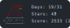

  <h3>My GitHub Statistics</h3>
  

    
    &nbsp;&nbsp;
    
  

  <h3>Currently used technologies</h3>
  

<!-- START_CONTRIBUTIONS -->
<h3>Contributed to following projects</h3>
<table>
<tr><td></td><td><a href='https://github.com/sebinside/StreamAwesome' target='_blank'>StreamAwesome</a></td><td>4 contributions</td><td>Vue</td></tr>
<tr><td></td><td><a href='https://github.com/tandpfun/skill-icons' target='_blank'>skill-icons</a></td><td>1 contribution</td><td>SVG</td></tr>
<tr><td></td><td><a href='https://github.com/Dieserartist/ClickMyLinks' target='_blank'>ClickMyLinks</a></td><td>1 contribution</td><td>CSS</td></tr>
</table>
<!-- END_CONTRIBUTIONS -->

 
 
 
 

<!-- START_AOC_BADGE -->

<!-- END_AOC_BADGE -->

